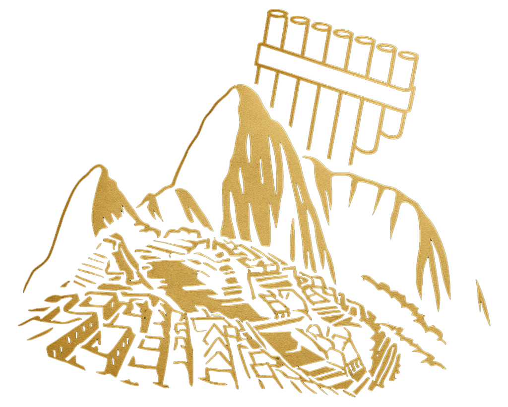
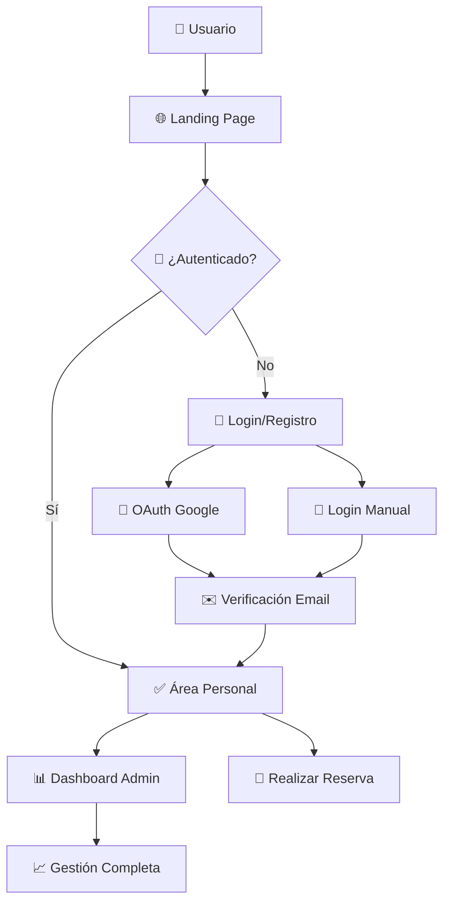

# 🌟 Antares Travel - Sistema Integral de Gestión Turística

<div align="center">



**Más que una agencia de viajes, somos creadores de experiencias extraordinarias**

[](https://php.net)
[](https://tailwindcss.com)
[](https://mysql.com)
[](https://developers.google.com/identity/protocols/oauth2)

[🌐 Ver Demo](http://localhost/Antares-Travel/) • [📊 Panel Admin](http://localhost/Antares-Travel/src/admin/) • [📚 Documentación](docs/)

---

*"El mundo es un libro y aquellos que no viajan leen solo una página."* - San Agustín

</div>

## 📋 Tabla de Contenidos

- [🎯 Descripción del Proyecto](#-descripción-del-proyecto)
- [✨ Características Principales](#-características-principales)
- [🏗️ Arquitectura del Sistema](#%EF%B8%8F-arquitectura-del-sistema)
- [🚀 Instalación y Configuración](#-instalación-y-configuración)
- [🎮 Uso del Sistema](#-uso-del-sistema)
- [🔐 Autenticación y Seguridad](#-autenticación-y-seguridad)
- [🎨 Interfaz de Usuario](#-interfaz-de-usuario)
- [📱 Responsividad](#-responsividad)
- [🔧 Configuración](#-configuración)
- [📈 Roadmap](#-roadmap)
- [🤝 Contribución](#-contribución)
- [📄 Licencia](#-licencia)

## 🎯 Descripción del Proyecto

**Antares Travel** es un sistema integral de gestión turística desarrollado en PHP 8+ que permite a las agencias de viajes administrar tours, reservas, personal y clientes de manera eficiente. Combina una landing page atractiva para clientes con un panel administrativo completo para la gestión interna.

### 🌟 **Misión**
Transformar la manera en que las personas descubren y experimentan el mundo, creando conexiones auténticas entre viajeros y destinos extraordinarios.

### 🎪 **Visión**
Ser la plataforma líder en gestión turística que democratiza el acceso a experiencias de viaje únicas y personalizadas.

## ✨ Características Principales

### 🌐 **Landing Page Moderna**
- 🎨 **Diseño Responsivo**: Mobile-first con animaciones CSS3 avanzadas
- 🖼️ **Galería Interactiva**: Carousel automático con 5 imágenes hero
- 🌍 **Multiidioma**: Soporte completo ES/EN con switching dinámico
- 📱 **Google One Tap**: Autenticación instantánea con Google
- 🗺️ **Destinos Destacados**: Machu Picchu, Valle Sagrado, Montaña 7 Colores
- 👥 **Guías Especializados**: Perfiles de guías expertos certificados
- 📸 **Galería de Experiencias**: Showcase visual de tours y aventuras
- 💬 **Testimonios Dinámicos**: Sistema de comentarios con filtros
- 📝 **Formulario de Reservas**: Captura de leads con validación
- 📧 **Información de Contacto**: Múltiples canales de comunicación

### 🔐 **Sistema de Autenticación Híbrida**
- 🔑 **Login Manual**: Email/password con hash seguro
- 🚀 **OAuth Integrado**: Google, Microsoft, Apple Sign-In
- ✉️ **Verificación Email**: Sistema de confirmación por correo
- 🔄 **Recuperación Password**: Reset seguro con tokens
- 👤 **Gestión Perfiles**: Avatar personalizable y datos de usuario
- 🛡️ **Sesiones Seguras**: Manejo robusto de sesiones PHP

### 📊 **Panel Administrativo Completo**
- 📈 **Dashboard Analytics**: Estadísticas en tiempo real
- 📅 **Gestión de Tours**: Programación y administración de tours
- 📝 **Sistema de Reservas**: CRUD completo de reservas
- 👥 **Administración Personal**: Guías, choferes, vehículos
- 💰 **Control Financiero**: Reportes de ventas y ingresos
- 📋 **Gestión Clientes**: Base de datos de clientes
- 🎯 **Configuración Sistema**: Personalización completa

### 🎨 **UI/UX Moderna**
- 🎭 **Diseño Glassmorphism**: Efectos de vidrio y transparencias
- 🌈 **Gradientes Dinámicos**: Paleta azul-púrpura profesional
- ⚡ **Animaciones Fluidas**: Transiciones CSS optimizadas
- 🔥 **Hover Effects**: Micro-interacciones intuitivas
- 📱 **Mobile-First**: Diseño optimizado para dispositivos móviles
- ♿ **Accesibilidad**: Contraste y navegación por teclado

## 🏗️ Arquitectura del Sistema

### 🔧 **Stack Tecnológico**

| Tecnología | Versión | Propósito | Estado |
|------------|---------|-----------|---------|
| **PHP** | 8.0+ | Backend y lógica del servidor | ✅ Activo |
| **MySQL** | 8.0+ | Base de datos principal | ✅ Activo |
| **TailwindCSS** | 3.x | Framework CSS utilitario | ✅ Activo |
| **Alpine.js** | 3.x | Reactividad en el frontend | ✅ Activo |
| **Font Awesome** | 6.x | Iconografía | ✅ Activo |
| **Google OAuth** | 2.0 | Autenticación social | ✅ Activo |
| **XAMPP** | 8.x | Entorno de desarrollo | ✅ Activo |

### 📁 **Estructura de Directorios**

```
Antares-Travel/
├── 📁 imagenes/                    # Assets e imágenes
│   ├── antares_logozz2.png         # Logo principal
│   ├── fondo01.jpg - fondo05.jpg   # Imágenes hero carousel
│   └── ...
├── 📁 public/                      # Archivos públicos
│   ├── 📁 assets/
│   │   └── 📁 css/
│   │       └── styles_landing.css  # Estilos principales
│   └── example.php                 # Página de ejemplo
├── 📁 src/                         # Código fuente
│   ├── 📁 admin/                   # Panel administrativo
│   │   ├── dashboard.php           # Dashboard principal
│   │   ├── sidebar.php             # Sidebar responsivo
│   │   └── README.md               # Documentación admin
│   ├── 📁 auth/                    # Sistema de autenticación
│   │   ├── login.php               # Página de login
│   │   ├── register.php            # Registro de usuarios
│   │   ├── oauth_callback.php      # Callback OAuth
│   │   └── profile.php             # Perfil de usuario
│   ├── 📁 config/                  # Configuraciones
│   │   ├── conexion.php            # Conexión a BD
│   │   └── routes.php              # Rutas del sistema
│   └── 📁 functions/               # Funciones del sistema
│       ├── google_auth.php         # Autenticación Google
│       └── usuarios.php            # Funciones de usuarios
├── 📁 storage/                     # Almacenamiento
│   └── 📁 uploads/
│       └── 📁 avatars/             # Avatares de usuario
├── 📁 test/                        # Archivos de prueba
├── index.php                       # Landing page principal
├── nx.json                         # Configuración Nx
└── README.md                       # Este archivo
```

### 🌊 **Flujo de la Aplicación**



## 🚀 Instalación y Configuración

### ⚡ **Instalación Rápida**

1. **Clonar el repositorio:**
   ```bash
   git clone https://github.com/usuario/Antares-Travel.git
   cd Antares-Travel
   ```

2. **Configurar XAMPP:**
   - Instalar XAMPP 8.0+
   - Iniciar Apache y MySQL
   - Copiar proyecto a `htdocs/`

3. **Configurar base de datos:**
   ```sql
   CREATE DATABASE antares_travel;
   USE antares_travel;
   
   -- Importar estructura desde schema.sql
   SOURCE database/schema.sql;
   ```

4. **Configurar credenciales:**
   ```php
   // src/config/conexion.php
   $host = "localhost";
   $usuario = "root";
   $password = "";
   $base_datos = "antares_travel";
   ```

### 🗄️ **Configuración de Base de Datos**

```sql
-- Tabla de usuarios
CREATE TABLE usuarios (
    id INT AUTO_INCREMENT PRIMARY KEY,
    nombre VARCHAR(100) NOT NULL,
    email VARCHAR(100) UNIQUE NOT NULL,
    password_hash VARCHAR(255),
    avatar_url VARCHAR(255),
    google_id VARCHAR(100),
    email_verificado BOOLEAN DEFAULT FALSE,
    fecha_registro TIMESTAMP DEFAULT CURRENT_TIMESTAMP
);

-- Tabla de tours
CREATE TABLE tours (
    id INT AUTO_INCREMENT PRIMARY KEY,
    nombre VARCHAR(200) NOT NULL,
    descripcion TEXT,
    precio DECIMAL(10,2),
    duracion_dias INT,
    max_personas INT,
    fecha_creacion TIMESTAMP DEFAULT CURRENT_TIMESTAMP
);

-- Tabla de reservas
CREATE TABLE reservas (
    id INT AUTO_INCREMENT PRIMARY KEY,
    usuario_id INT,
    tour_id INT,
    fecha_reserva DATE,
    num_personas INT,
    estado ENUM('pendiente', 'confirmada', 'cancelada'),
    fecha_creacion TIMESTAMP DEFAULT CURRENT_TIMESTAMP,
    FOREIGN KEY (usuario_id) REFERENCES usuarios(id),
    FOREIGN KEY (tour_id) REFERENCES tours(id)
);
```

### 🔑 **Configuración OAuth (Google)**

1. **Crear proyecto** en [Google Cloud Console](https://console.cloud.google.com/)
2. **Habilitar Google+ API**
3. **Crear credenciales OAuth 2.0**
4. **Configurar** en `src/functions/google_auth.php`:
   ```php
   $client->setClientId('tu-client-id.googleusercontent.com');
   $client->setClientSecret('tu-client-secret');
   $client->setRedirectUri('http://localhost/Antares-Travel/');
   ```

5. **Configurar One Tap** en `index.php`:
   ```html
   <div id="g_id_onload"
        data-client_id="tu-client-id.googleusercontent.com"
        data-context="signin"
        data-ux_mode="popup"
        data-auto_prompt="true"
        data-callback="handleCredentialResponse">
   </div>
   ```

## 🎮 Uso del Sistema

### 🌐 **Landing Page**

**Acceso:** `http://localhost/Antares-Travel/`

**Características:**
- ✨ Hero section con carousel automático (5 imágenes)
- 🗺️ Sección de destinos destacados con overlay effects
- 👥 Perfiles de guías especializados
- 📸 Galería de experiencias visual
- 💬 Sistema de testimonios con filtros
- 📝 Formulario de reservas integrado
- 🌍 Switching de idiomas ES/EN en tiempo real
- 🔐 Login con Google One Tap

### 👨‍💼 **Panel Administrativo**

**Acceso:** `http://localhost/Antares-Travel/src/admin/`

#### 📊 **Dashboard Principal**
- **Estadísticas en tiempo real**: Reservas, tours, usuarios, ventas
- **Accesos rápidos**: Crear reservas, programar tours, ver reportes
- **Vista responsiva**: Optimizada para móvil y desktop

#### 🗓️ **Gestión de Tours**
- Crear/editar/eliminar tours
- Configurar precios y disponibilidad
- Asignar guías y vehículos
- Generar itinerarios

#### 📝 **Sistema de Reservas**
- Gestión completa de reservas
- Estados: pendiente, confirmada, cancelada
- Comunicación con clientes
- Reportes de ocupación

#### 👥 **Administración de Personal**
- Gestión de guías turísticos
- Control de choferes
- Administración de vehículos
- Asignación de tours

## 🔐 Autenticación y Seguridad

### 🛡️ **Medidas de Seguridad Implementadas**

- **🔒 Hash de Contraseñas**: `password_hash()` con BCRYPT
- **🚫 Prevención SQL Injection**: Prepared statements
- **🛡️ Validación de Datos**: Sanitización de inputs
- **🔐 Sesiones Seguras**: Regeneración de session_id
- **🌐 OAuth Seguro**: Verificación de tokens JWT
- **✉️ Verificación Email**: Tokens únicos por usuario

### 🔑 **Flujo de Autenticación**

1. **Registro Manual**:
   ```php
   // Hash seguro de contraseña
   $password_hash = password_hash($password, PASSWORD_BCRYPT);
   
   // Inserción con prepared statement
   $stmt = $conn->prepare("INSERT INTO usuarios (nombre, email, password_hash) VALUES (?, ?, ?)");
   $stmt->bind_param("sss", $nombre, $email, $password_hash);
   ```

2. **Google OAuth**:
   ```php
   // Verificación de token JWT
   $payload = $client->verifyIdToken($credential);
   if ($payload) {
       $google_id = $payload['sub'];
       $email = $payload['email'];
       $name = $payload['name'];
       $picture = $payload['picture'];
   }
   ```

3. **Verificación de Email**:
   ```php
   // Generar token único
   $token = bin2hex(random_bytes(32));
   
   // Enviar email de verificación
   mail($email, "Verificar cuenta", "Token: $token");
   ```

## 🎨 Interfaz de Usuario

### 🎭 **Sistema de Diseño**

**Paleta de Colores:**
```css
:root {
    --primary-bg: #0f172a;
    --primary-light: #3b82f6;
    --primary-dark: #1e40af;
    --accent-gold: #fbbf24;
    --glass-bg: rgba(255, 255, 255, 0.1);
    --text-light: #f8fafc;
    --text-dark: #1e293b;
}
```

**Tipografía:**
- **Principal**: Poppins (300, 400, 500, 600, 700)
- **Iconos**: Font Awesome 6.x
- **Tamaños**: Sistema escalable con rem

### 🌈 **Efectos Visuales**

**Glassmorphism:**
```css
.glass-card {
    background: rgba(255, 255, 255, 0.1);
    backdrop-filter: blur(10px);
    border-radius: 16px;
    border: 1px solid rgba(255, 255, 255, 0.2);
    box-shadow: 0 8px 32px 0 rgba(31, 38, 135, 0.37);
}
```

**Hover Effects:**
```css
.hover-lift {
    transition: transform 0.3s cubic-bezier(0.4, 0, 0.2, 1);
}

.hover-lift:hover {
    transform: translateY(-8px);
}
```

**Animaciones:**
```css
@keyframes fadeInUp {
    from {
        opacity: 0;
        transform: translateY(30px);
    }
    to {
        opacity: 1;
        transform: translateY(0);
    }
}

.fade-in {
    animation: fadeInUp 0.6s ease-out forwards;
}
```

## 📱 Responsividad

### 📐 **Breakpoints del Sistema**

```css
/* Mobile First Approach */
/* Mobile: 320px - 768px */
.container {
    padding: 0 1rem;
    max-width: 100%;
}

/* Tablet: 768px - 1024px */
@media (min-width: 768px) {
    .container {
        padding: 0 2rem;
        max-width: 768px;
    }
}

/* Desktop: 1024px+ */
@media (min-width: 1024px) {
    .container {
        padding: 0 3rem;
        max-width: 1200px;
        margin: 0 auto;
    }
}
```

### 📱 **Características Móviles**

**Navegación Móvil:**
```css
.mobile-nav {
    position: fixed;
    top: 0;
    left: -100%;
    width: 80%;
    height: 100vh;
    background: var(--primary-bg);
    transition: left 0.3s ease;
    z-index: 1000;
}

.mobile-nav.active {
    left: 0;
}
```

**Sidebar Responsivo (Admin):**
```css
@media (max-width: 768px) {
    .sidebar-fixed { 
        position: fixed; 
        top: 0; 
        left: 0; 
        height: 100vh; 
        z-index: 50; 
        transform: translateX(-100%); 
        transition: transform 0.3s ease-in-out;
    }
    
    .sidebar-fixed.show {
        transform: translateX(0);
    }
}
```

## 🔧 Configuración

### ⚙️ **Variables de Entorno**

```php
// src/config/config.php
define('DB_HOST', 'localhost');
define('DB_USER', 'root');
define('DB_PASS', '');
define('DB_NAME', 'antares_travel');

define('GOOGLE_CLIENT_ID', 'tu-client-id.googleusercontent.com');
define('GOOGLE_CLIENT_SECRET', 'tu-client-secret');
define('GOOGLE_REDIRECT_URI', 'http://localhost/Antares-Travel/');

define('APP_URL', 'http://localhost/Antares-Travel/');
define('UPLOAD_PATH', 'storage/uploads/');
```

### 📧 **Configuración de Email**

```php
// src/functions/mail.php
$mail = new PHPMailer(true);
$mail->isSMTP();
$mail->Host = 'smtp.gmail.com';
$mail->SMTPAuth = true;
$mail->Username = 'tu-email@gmail.com';
$mail->Password = 'tu-app-password';
$mail->SMTPSecure = PHPMailer::ENCRYPTION_STARTTLS;
$mail->Port = 587;
```

## 📈 Roadmap

### ✅ **Completado**

- [x] Landing page responsiva con carousel hero
- [x] Sistema de autenticación híbrida (manual + OAuth)
- [x] Panel administrativo con sidebar responsivo
- [x] Gestión básica de tours y reservas
- [x] Dashboard con estadísticas
- [x] Sistema multiidioma ES/EN
- [x] Google One Tap authentication
- [x] Diseño glassmorphism moderno
- [x] Formulario de reservas funcional

### 🚧 **En Desarrollo**

- [ ] Sistema de notificaciones en tiempo real
- [ ] Integración con pasarelas de pago (PayPal, Stripe)
- [ ] API REST para aplicaciones móviles
- [ ] Sistema de reviews y calificaciones
- [ ] Chat en vivo para soporte al cliente
- [ ] Sistema de cupones y descuentos

### 🔮 **Futuro**

- [ ] Aplicación móvil nativa (React Native)
- [ ] Integración con redes sociales
- [ ] Sistema de fidelización de clientes
- [ ] Multi-tenancy para múltiples agencias
- [ ] Inteligencia artificial para recomendaciones
- [ ] Sistema de mapas interactivos
- [ ] Integración con calendarios externos

## 🤝 Contribución

### 🛠️ **Cómo Contribuir**

1. **Fork** el proyecto
2. **Crear** una rama feature (`git checkout -b feature/AmazingFeature`)
3. **Commit** los cambios (`git commit -m 'Add some AmazingFeature'`)
4. **Push** a la rama (`git push origin feature/AmazingFeature`)
5. **Abrir** un Pull Request

### 📝 **Estándares de Código**

- **PHP**: PSR-12 coding standard
- **CSS**: BEM methodology
- **JavaScript**: ES6+ features
- **Commits**: Conventional Commits format

### 🐛 **Reportar Bugs**

Usa el [issue tracker](https://github.com/usuario/Antares-Travel/issues) para reportar bugs. Incluye:
- Descripción detallada del problema
- Pasos para reproducir
- Comportamiento esperado vs actual
- Screenshots si es aplicable

## 📄 Licencia

Este proyecto está licenciado bajo la MIT License - ver el archivo [LICENSE.md](LICENSE.md) para detalles.

---

## 🙏 Agradecimientos

**Antares Travel** ha sido posible gracias a:

- **🌟 Comunidad PHP**: Por las librerías y frameworks utilizados
- **🎨 TailwindCSS Team**: Por el framework CSS excepcional
- **⚡ Alpine.js Community**: Por la reactividad simple y poderosa
- **🔗 Google**: Por las APIs de autenticación
- **👥 Beta Testers**: Por el feedback invaluable
- **📸 Unsplash**: Por las imágenes de alta calidad
- **🎯 Font Awesome**: Por la iconografía profesional

---

<div align="center">

**Hecho con ❤️ para revolucionar la industria turística**

**[⭐ Star este proyecto](https://github.com/usuario/Antares-Travel)** si te ha sido útil

[](https://github.com/usuario/Antares-Travel)
[](https://github.com/usuario/Antares-Travel/fork)
[](https://github.com/usuario/Antares-Travel/issues)

---

### 📞 Contacto

- **📧 Email**: info@antarestravel.com
- **📱 Teléfono**: +51 84 234 567
- **📍 Dirección**: Av. Sol 123, Cusco, Perú
- **🌐 Website**: [www.antarestravel.com](http://localhost/Antares-Travel/)

### 🔗 Enlaces Útiles

- [📊 Panel Administrativo](http://localhost/Antares-Travel/src/admin/)
- [🔐 Login](http://localhost/Antares-Travel/src/auth/login.php)
- [📝 Registro](http://localhost/Antares-Travel/src/auth/register.php)
- [📚 Documentación API](docs/api.md)
- [🎨 Guía de Diseño](docs/design-system.md)

---

*"Donde cada viaje es una historia, y cada historia es una aventura extraordinaria."*

**© 2024 Antares Travel. Todos los derechos reservados.**

</div>
